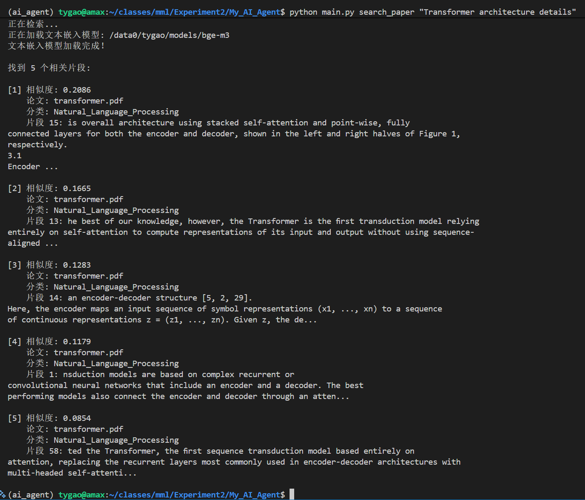
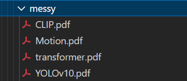
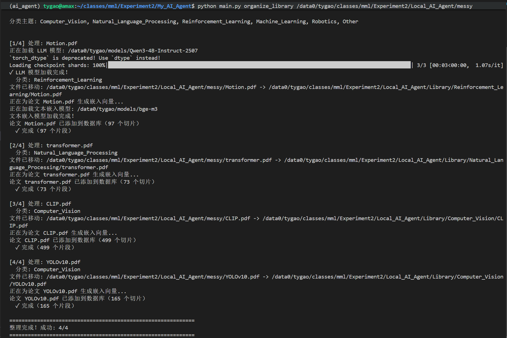
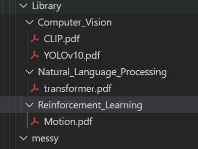
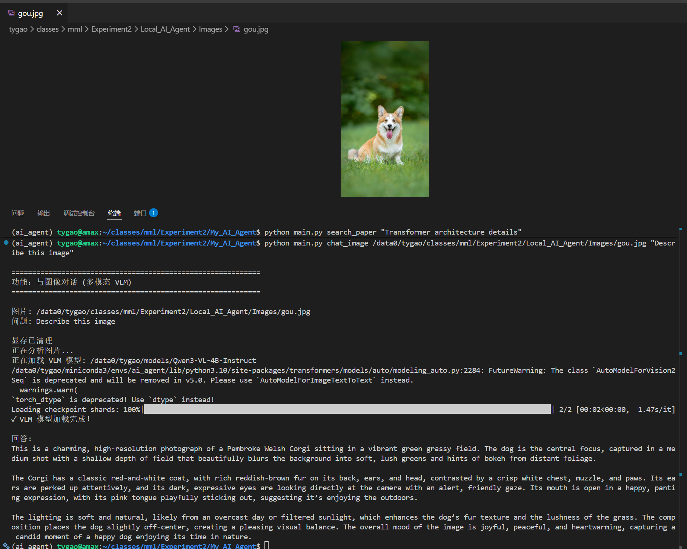

# 📚 Local AI Agent

**Local AI Agent** 是一个基于 Qwen3 系列模型构建的本地化智能助手，旨在通过多模态大模型技术，实现对本地文献（PDF）和图像资料的智能化管理、检索与交互。

本项目完全运行在本地环境中，保障数据隐私安全，同时利用最新的 LLM 和 VLM 技术提供强大的语义理解能力。

---

## 📺 演示视频 (Demo Video)
下方视频演示了从环境配置、启动到核心功能（论文分类、语义搜索、图像对话）的完整使用流程。

<div align="center">
  <video src="https://github.com/user-attachments/assets/630b3466-1389-4b5e-910b-4e56c3d06b7d" controls autoplay muted loop>
    您的浏览器不支持视频播放
  </video>
</div>

---

## ✨ 核心功能 (Core Features)

### 📄 智能文献管理
- **语义搜索**：不再局限于关键词，使用自然语言（如"Transformer的注意力机制原理"）精准查找论文内容。
- **自动分类**：基于 LLM 深度理解论文摘要与正文，自动识别主题并将 PDF 归档到对应文件夹。
- **智能问答 (RAG)**：基于本地论文库构建知识库，能够回答关于论文细节的专业问题。
- **批量整理**：一键扫描混乱的下载文件夹，自动重命名、分类并建立索引。

### 🖼️ 智能图像管理
- **以文搜图**：通过自然语言描述（如"飞驰的汽车"）快速查找本地图片库中的相关图片。
- **图像对话**：支持与图像进行多模态对话，让 AI 解释图表、分析场景或提取信息。
- **自动索引**：批量建立图片向量索引，支持大规模图库的毫秒级检索。

---

## 📸 运行截图 (Screenshots)

### 1. 语义搜索结果
> 
> *(展示通过自然语言搜索论文的返回结果，包含相关度评分与原文片段)*

### 2. 智能分类后的文件夹结构
> 
>
> *(展示自动分类整理前的 messy 目录结构，混乱不堪)*
>
> 
>
> *(展示自动分类整理的过程)*
>
> 
>
> *(展示自动分类整理后的 Library 目录结构，清晰有序)*

### 3. 多模态图像对话
> 
> *(展示与图像进行交互对话的界面，模型准确理解图像内容)*

---

## 🏗️ 技术架构 (Technical Architecture)

本项目采用了 "Router-Expert" 模式与模块化设计，核心组件如下：

### 模型栈 (Model Stack)
| 组件 | 模型 | 用途 |
|------|------|------|
| **大语言模型 (LLM)** | Qwen3-4B-Instruct | 负责文本理解、论文分类、RAG 问答生成 |
| **视觉语言模型 (VLM)** | Qwen3-VL-4B-Instruct | 负责图像理解、多模态对话交互 |
| **文本嵌入 (Text Embedding)** | BAAI/bge-m3 | 生成高质量文本向量，用于论文语义检索 |
| **图像嵌入 (Image Embedding)** | OpenAI/CLIP-ViT-Large | 生成图像与文本的统一语义向量，用于以文搜图 |
| **向量数据库 (Vector DB)** | ChromaDB | 高效存储与检索海量向量数据 |

### 硬件要求
- **推荐配置**：NVIDIA RTX 4090
- **最低配置**：8GB+ GPU VRAM
- **操作系统**：Linux / Windows / macOS

---

## 📦 环境配置与安装 (Installation)

### 1. 克隆项目
```bash
git clone https://github.com/godrayyyy/Local_AI_Agent.git
cd Local_AI_Agent
```

### 2. 创建虚拟环境
推荐使用 Conda 管理环境：
```bash
conda create -n qwen3_agent python=3.10 -y
conda activate qwen3_agent
```

### 3. 安装依赖
```bash
# 安装 PyTorch (根据你的 CUDA 版本调整)
pip install torch torchvision torchaudio --index-url https://download.pytorch.org/whl/cu121

# 安装项目依赖
pip install -r requirements.txt
```

### 4. 模型准备与配置
请确保已下载所需的模型权重文件。编辑 `config.py` 文件，设置本地模型路径：

```python
# config.py

# LLM 模型路径
LLM_MODEL_PATH = "/path/to/Qwen3-4B-Instruct"

# VLM 模型路径
VLM_MODEL_PATH = "/path/to/Qwen3-VL-4B-Instruct"

# Embedding 模型路径
TEXT_EMBEDDING_MODEL = "/path/to/bge-m3"
IMAGE_EMBEDDING_MODEL = "/path/to/clip-vit-large-patch14-336"
```

### 5. 初始化目录
```bash
# 创建必要的存储目录
mkdir -p Library Images data
```

---

## 🚀 详细使用说明 (Usage Guide)

所有功能均通过 `main.py` 统一入口调用。

### 1. 系统自检
查看当前环境配置、GPU 状态及模型加载情况。
```bash
python main.py info
```

### 2. 论文管理

#### ➤ 添加单篇论文（自动分类）
系统会自动读取 PDF 内容，识别主题，将其移动到 `Library` 下的对应分类目录，并建立索引。
```bash
# 基本用法
python main.py add_paper /path/to/your/paper.pdf

# 指定候选分类主题（覆盖默认配置）
python main.py add_paper paper.pdf --topics "CV,NLP,RL,Robotics"
```

#### ➤ 语义搜索论文
使用自然语言查找库中的论文。
```bash
# 搜索关于 Transformer 架构的内容
python main.py search_paper "Transformer architecture details"

# 指定返回最相关的 10 条结果
python main.py search_paper "attention mechanism" --top_k 10
```

#### ➤ 智能问答 (RAG)
基于论文库的内容回答问题，适合进行文献综述或细节查询。
```bash
python main.py ask_paper "What are the main advantages of Transformer?"
```

#### ➤ 批量整理文件夹
如果你有一个堆满 PDF 的混乱文件夹，使用此命令一键整理。
```bash
python main.py organize_library /path/to/messy/download/folder
```

### 3. 图像管理

#### ➤ 建立图像索引
在进行搜索前，需要先对图片库建立索引。
```bash
python main.py index_images ./Images
```

#### ➤ 以文搜图
```bash
# 搜索包含"猫"的图片
python main.py search_image "a cute cat"

# 搜索"飞驰的汽车"
python main.py search_image "飞驰的汽车"
```

#### ➤ 多模态图像对话
让 AI 描述图片内容或回答关于图片的问题。
```bash
python main.py chat_image /path/to/image.jpg "Describe this image"
```

---

## ⚙️ 配置说明 (Configuration)

主要配置位于 `config.py` 文件中：

- **`PAPER_TOPICS`**: 自定义论文分类的类别列表。
- **`CHUNK_SIZE`**: 文本切片大小，影响检索的粒度。
- **`RETRIEVAL_TOP_K`**: 默认检索返回的结果数量。

---

## 🗂️ 项目结构 (Project Structure)

```
My_AI_Agent/
├── main.py                 # [入口] 命令行主程序
├── config.py               # [配置] 模型路径与参数配置
├── requirements.txt        # [依赖] Python 依赖列表
├── README.md               # [文档] 项目说明文档
│
├── core/                   # [核心] 模型引擎模块
│   ├── llm_engine.py       # LLM 推理封装
│   ├── vlm_engine.py       # VLM 推理封装
│   ├── embedding.py        # 文本/图像向量化封装
│   └── db_manager.py       # 向量数据库管理
│
├── utils/                  # [工具] 通用工具函数
│   ├── pdf_parser.py       # PDF 文本提取与切分
│   ├── file_ops.py         # 文件移动与扫描
│   └── gpu_utils.py        # 显存管理工具
│
├── Library/                # [数据] 论文存储库（自动分类）
├── Images/                 # [数据] 图片存储库
└── data/                   # [数据] 向量数据库存储
```

---

## 📄 License

本项目采用 [MIT License](LICENSE) 开源。

## 🙏 致谢

- [Qwen](https://github.com/QwenLM/Qwen) - 强大的通义千问开源模型
- [ChromaDB](https://www.trychroma.com/) - 优秀的开源向量数据库
- [Sentence Transformers](https://www.sbert.net/) - 文本嵌入支持
